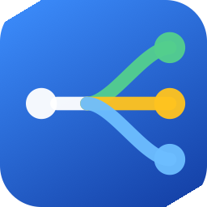

# Browser Picker - Rule-Based URL Router for macOS

<p align="center">
  
</p>

<p align="center">
  <a href="README.tr.md">Türkçe</a>
</p>

A lightweight macOS menu bar app that intercepts every link you click and sends it to the right browser automatically.

You define rules based on which app opened the link and which domain it points to. Browser Picker evaluates them in priority order and opens the first match — in the browser you chose, optionally in incognito mode or a new window.

[Download](#download) · [Features](#features) · [How It Works](#how-it-works) · [Build](#run-locally)

---

## Download

Grab the latest DMG from the [releases page](../../releases/latest).

1. Open the DMG and drag **Browser Picker** to Applications.
2. If macOS says the app is damaged or can't be opened, run:
   ```
   xattr -cr /Applications/BrowserPicker.app
   ```
3. Launch Browser Picker — it appears in the menu bar, not the Dock.

---

## Features

- Route links to different browsers based on rules you define
- Match by source app (the app that opened the link), domain pattern, or both
- Domain matching supports exact hostnames, wildcards (`*.github.com`), and full regex
- Open matched links in incognito / private mode or a new window
- Zero third-party dependencies — no update frameworks, no telemetry
- Config stored as plain JSON at `~/.config/browserpicker/config.json`

---

## How It Works

1. You set Browser Picker as your default browser in System Settings.
2. When any app opens an `http` or `https` link, macOS hands it to Browser Picker.
3. Browser Picker checks which app sent the link and what the URL's hostname is.
4. Rules are sorted by priority; the first rule whose conditions all match wins.
5. The winning browser opens the URL — with incognito or new-window flags if configured.
6. If no rule matches, the link opens in the browser you set as your default inside Browser Picker.

---

## First Setup

1. Install from DMG and open the app.
2. Click the menu bar icon and open **Settings** (⌘,).
3. Click **Set Default** in the General tab to register Browser Picker as your system default browser.
4. Switch to the **Rules** tab and add your first rule.
5. Assign a source app, a domain pattern, and the target browser for each rule.

---

## Project Structure

```text
browser-picker/
├── BrowserPicker/
│   ├── BrowserPickerApp.swift   — app entry point
│   ├── AppDelegate.swift        — URL interception, routing dispatch
│   ├── AppTracker.swift         — tracks the frontmost app (@MainActor)
│   ├── PickerConfig.swift       — data models (PickerConfig, RoutingRule, AppMatcher, URLMatcher)
│   ├── Router.swift             — rule evaluation engine
│   ├── ConfigStore.swift        — JSON config file I/O
│   ├── Scanners.swift           — installed browser and app detection
│   ├── BrowserOpener.swift      — launches browsers with the right flags
│   ├── AppLog.swift             — structured logging (console + file)
│   ├── MenuBarIcon.swift        — custom template image for the menu bar
│   ├── MenuBarView.swift        — menu bar dropdown
│   ├── SettingsView.swift       — settings window (Rules / General tabs)
│   ├── RuleRowView.swift        — rule editor row component
│   └── AboutView.swift          — about dialog
├── BrowserPickerTests/
│   ├── RouterTests.swift        — rule engine tests (25 cases)
│   ├── URLMatcherTests.swift    — domain matching tests (18 cases)
│   ├── AppMatcherTests.swift    — source app matching tests (9 cases)
│   └── ConfigTests.swift        — config encode/decode and store tests
├── scripts/
│   └── build-release-dmg.sh    — builds the release DMG
├── docs/
│   └── logo.png
└── generate_icon.swift          — generates all AppIcon PNG sizes
```

---

## Requirements

- macOS 14.0 or later
- Xcode 15 or later (to build from source)

---

## Run Locally

```bash
git clone https://github.com/sarisen/browser-picker.git
cd browser-picker
open BrowserPicker.xcodeproj
```

Or build from the command line:

```bash
make build   # Debug build
make test    # Run all tests
make install # Build and copy to /Applications
```

Tagged releases are built and published automatically via GitHub Actions.

---

## License

MIT.
